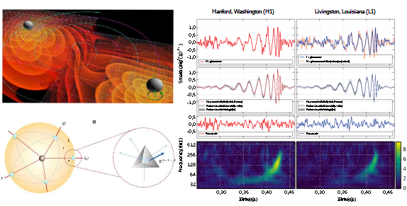

# Quantum-Gravity-Signatures-in-Gravitational-Wave-Astronomy
The future prospects for detecting the signatures of quantum gravity in current and future gravitational wave observational data

https://repository.lsu.edu/cgi/viewcontent.cgi?article=1229&context=physics_astronomy_pubs

https://arxiv.org/abs/2208.11095

